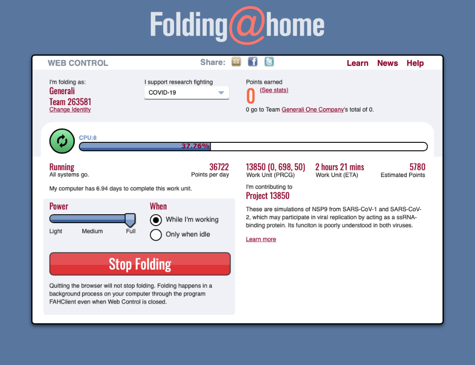

# Kurzanleitung Ersteinrichtung des Folding@Home-Clients

Red Lions vs. COVID-19 - Gemeinsam. Digital. Für ein Heilmittel.

Projekt COVID-19  
Team “Red Insurance Lions”  
Team ID 263581  

[🇬🇧 English translation](README.md)

## Abgrenzung

Eine Anleitung zur Einrichtung der Folding@Home-Clients zu Gunsten der COVID-19-Forschung an einem **gemeinsamen, privaten Engagement** mitzuwirken.

## Zweck
Mit der Unterstützung von „Folding@Home“ können wir uns alle an der digitalen Suche nach einem Heilmittel gegen das Virus SARS-CoV-2 ("Corona-Krise").

Mit einer Beteiligung an dieser digitalen Initiative senden wir  ein positives Signal an alle Kollegen:innen, Freunde, Bekannten und Partner im Home Office zum Mitmachen. Jeder kann sich freiwillig mit Rechenleistung des privaten PCs an unserem F@H-Team „The Red Insurance Lions“ ("Red Lions") engagieren.

Die Suche nach einem Heilmittel sehen wir in unserer aller Verantwortung , unsere Familie, Freunde, Bekannten, Kollegen und Kunden langfristig vor einer Erkrankung aber auch vor Auswirkungen durch das Virus zu schützen.

## Download des Clients

Durch den Aufruf der Seite

https://foldingathome.org/start-folding/

könnt ihr den Client für Euer Betriebssystem laden.

Es stehen Clients für Windows, Mac, Linux, Android und als VMware zur Verfügung. Darüber hinaus werden Images für Docker/Openshift angeboten. Wir konzentrieren uns erstmal auf die Clients Windows und Mac.

Alle Downloads in der Übersicht:
https://foldingathome.org/alternative-downloads/

#### Windows (Stand 23.04.2020):
https://download.foldingathome.org/releases/public/release/fah-installer/windows-10-32bit/v7.6/fah-installer_7.6.9_x86.exe

#### Mac  (Stand 23.04.2020):
https://download.foldingathome.org/releases/public/release/fah-installer/osx-10.11-64bit/v7.6/fah-installer_7.6.9_x86_64.mpkg.zip

## Installation des Clients

Der Client ist je nach vorhandenem Betriebssystem wie jede Anwendung auch zu installieren. Bei der Installation wird ein Hintergrundprozess installiert, der die Berechnung je nach Benutzereinstellungen vornimmt. 

Starte die heruntergeladene Datei und bestätigt die Dialoge der Installationsroutine. Für Windows gibt es eine ausführliche englische Anleitung:

https://foldingathome.org/support/faq/installation-guides/windows/custom-installation-advanced-users/

Nach der Installation wird der Client automatisch ausgeführt. In eurem Browser wird eine ersten Übersicht geöffnet. Diese Übersicht kann später auch durch den Aufruf der Seite

http://client.foldingathome.org 

Eurem Browser erneut erreicht werden. Beim ersten Aufruf oder durch Auswahl von dem Link “Change Identity” könnt ihr hier die wichtigsten Daten angeben:

Name : _Dein Name oder Pseudonym (möglichst eindeutig)_
Passkey: _Dein individueller Passkey (siehe Abschnitt “Passkey”)_

Wichtig ist die Eingabe der richtigen Team Number für das Red Insurance Lions Worldwide-Team:

**263581**

Durch Auswahl der Schaltfläche “Save” könnt ihr diese Einstellungen speichern und das Browser-Fenster schließen. Der Client wird schon im Hintergrund ausgeführt. Derzeit unterstützen wir das Projekt COVID-19, daher ist im folgenden Bildschirm unter 

I support research fighting: COVID-19

auszuwählen.

## Eindeutiger Schlüssel / Passkey (optional)

Du kannst optional zu Deinem Namen/Pseudonym unter

https://apps.foldingathome.org/getpasskey

einen individuellen Schlüssel (Passkey) erzeugen. Damit können die Punkte später Deinem Konto eindeutig zugeordnet werden. Außerdem gibt es Bonuspunkte, wenn Du Dir einen Passkey erzeugst und diesen im Client angibst.

Er wird innerhalb weniger Minuten an Deine angegebene Email-Adresse gesendet.

## Auswahl des Projekts

Nach Angabe des Namens, der Teamnummer und des Passkey gelangst Du nach Auswahl der Schaltfläche “Save” in die Übersicht. In dieser Übersicht ist noch eine wichtige Einstellung vorzunehmen: das Projekt, welches Du unterstützen möchtest.

Du kannst aber auch jederzeit ein anderes Projekt unterstützen, da die Punkte nach jeder erfolgreicher Berechnung dem Team "Red Insurance Lions Worldwide" zugesprochen werden. Wir bitten Dich aber aktuell für das Projekt **COVID-19** rechnen zu lassen.

Möchtest Du zudem die Berechnung etwas schneller durchführen lassen und Du bist nicht auf die Performance Deines Systems angewiesen, dann kannst Du mit dem Schieberegler

POWER: **Full**

mehr Systemressourcen der Berechnung zusprechen. Das kannst Du natürlich jederzeit an Deine Systemleistung und Deine Anforderungen anpassen. Möchtet ihr, dass der Client nur arbeitet, wenn das System nicht ausgelastet (Idle) ist, wählt bitte die Option “Only when idle”.

Damit wäre die grundlegende Einstellung abgeschlossen und ihr unterstützt das Projekt Folding@Home im Generali-Team. Unseren gemeinsamen Erfolg könnt Ihr auf der Seite

https://stats.foldingathome.org/team/263581

einsehen.

In diesem Sinne:

Happy contributing!
