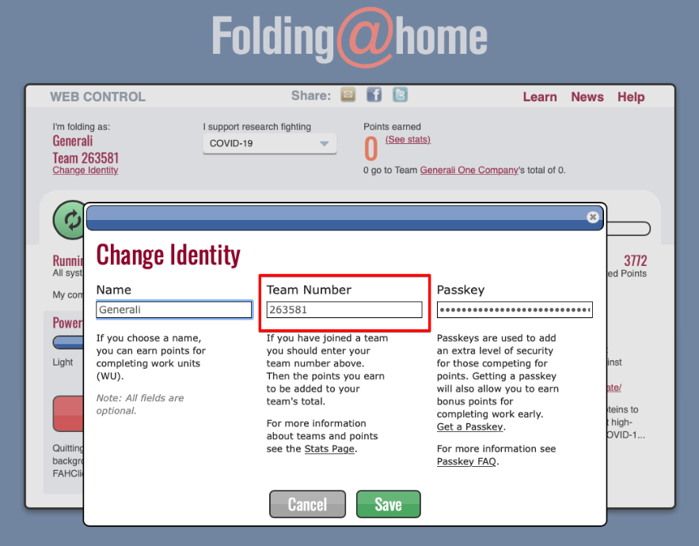
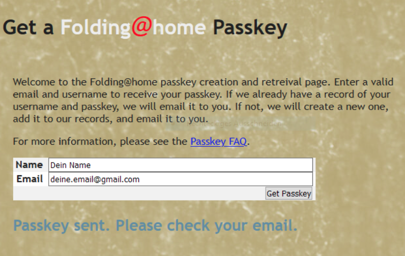
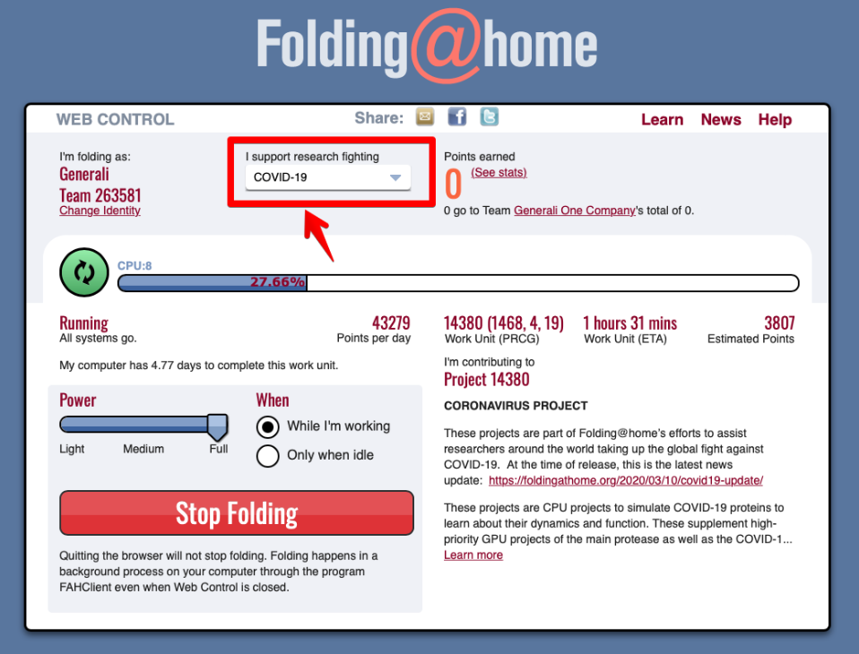

# Quick guide to setting up and configuring the Folding@Home client

Red Lions vs. COVID-19 - Together. Digital. For a cure.

Project COVID-19  
Team "Red Insurance Lions"  
Team ID 263581  

[🇩🇪 Deutsche Übersetzung](README.de.md)

## Note

A guide to setting up Folding@Home clients for the benefit of COVID-19 research to participate in a **joint, private commitment**.

## Purpose
With the support of the project "Folding@Home" we can all participate in the digital search for a cure for the SARS-CoV-2 virus ("Corona crisis").

By participating in this digital initiative, we send a positive signal to all colleagues, friends, acquaintances and partners in the home office to join in. Everyone can volunteer the computing power of their private PC to join our F@H team "The Red Insurance Lions" ("Red Lions").

We see the search for a cure as a responsibility to protect our family, friends, acquaintances, colleagues and customers in the long term from illness and the effects of the virus.

## Download the client

By calling the page

https://foldingathome.org/start-folding/

you can load the client for your operating system.

Clients are available for Windows, Mac, Linux, Android and as VMware. Furthermore, images for Docker/Openshift are offered. We will concentrate on the clients Windows and Mac for now.

All downloads in the overview:
https://foldingathome.org/alternative-downloads/

#### Windows (as of 04/23/20):
https://download.foldingathome.org/releases/public/release/fah-installer/windows-10-32bit/v7.6/fah-installer_7.6.9_x86.exe

#### Mac (as of 04/23/20):
https://download.foldingathome.org/releases/public/release/fah-installer/osx-10.11-64bit/v7.6/fah-installer_7.6.9_x86_64.mpkg.zip

## Installation of the client

Depending on the existing operating system, the client must be installed like any application. During installation, a background process is installed that performs the calculation according to user settings.

Start the downloaded file and confirm the dialogs of the installation routine. For Windows there is a detailed English manual:

https://foldingathome.org/support/faq/installation-guides/windows/custom-installation-advanced-users/

After installation, the client will run automatically. A first overview will be opened in your browser. This overview can also be opened later by calling the page

http://client.foldingathome.org 

your browser can be reached again. At the first call or by selecting the link "Change Identity" you can enter the most important data here:

(sorry, just german dialog shown at the moment)

Name : _Your name or pseudonym (as unique as possible)_
Passkey: _Your individual passkey (see section "Passkey")_

It is important to enter the correct Team Number for the Red Insurance Lions Worldwide ("Red Lions") team:

**263581**

By selecting the "Save" button you can save these settings and close the browser window. The client is already running in the background. At the moment we support the COVID-19 project, so please select in the following screen under

I support research fighting: **COVID-19**

## Unique key / Passkey (optional)

You can optionally add to your name/pseudonym under

https://apps.foldingathome.org/getpasskey

generate an individual key (passkey). With this key, the points can later be clearly assigned to your account. You will also receive bonus points if you create a passkey and enter it in the client.

It will be sent to your specified email address within a few minutes.

## Selection of the project

After entering the name, the team number and the passkey you will get to the overview after selecting the "Save" button. In this overview there is one more important setting to make: the project you want to support.

You can also support another project at any time, as points are awarded to Team "Red Insurance Lions Worldwide" after each successful calculation. But we ask you to calculate for the project **COVID-19**.

img4](images/img4.de.png)

If you would like to have the calculation performed a little faster and you are not dependent on the performance of your system, you can use the slider

POWER: **Full**

allocate more system resources to the calculation. Of course, you can always adjust this to your system performance and your requirements. If you want the client to work only when the system is idle, please select the option "Only when idle".

This would complete the basic setting and you support the Folding@Home project in the Generali team. You can see our common success on the page

https://stats.foldingathome.org/team/263581

All that remains to be said:

Happy contributing!
